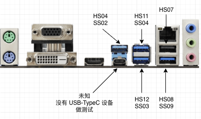

# asrock-z370m-pro4-hackintosh

[English version](./README-EN.md)

该项目只针对我的配置，仅供参考，不要盲目使用。

## 硬件

CPU：英特尔 i5 8400

主板：[华擎 Z370M Pro4](https://www.asrock.com/MB/Intel/Z370M%20Pro4/index.asp)

显卡：蓝宝石 RX560 4G D5 白金版 OC (75W)

Wi-Fi 和蓝牙：BCM943602CS

内存：英睿达 8G DDR4 2666 x 4

固态硬盘 0：英特尔 760P 512G NVMe M.2 （macOS）

固态硬盘 1：惠普 EX900 250G （macOS）

机械硬盘 0：东芝 1TB（time-machine）

机械硬盘 1：希捷 4TB（time-machine 和文件存储）

显示器 0：戴尔 U2718QM

显示器 1：戴尔 U2414H

Wi-Fi 和蓝牙芯片在 macOS 下插上就能用，不需要任何配置。

## BIOS 设置

BIOS 版本：3.20

Advanced \ Chipset Configuration → Vt-d : Disabled

Advanced \ Super IO Configuration → Serial Port: Disabled

Advanced \ USB Configuration → XHCI Hand-off : Enabled

Advanced \ Chipset Configuration → Share Memory : 128MB

Advanced \ Chipset Configuration → IGPU Multi-Monitor : Enabled

## UEFI 驱动说明

| 文件 | 备注 | 官网/文档 |
|------------------|---------------------------------------------------|---------------------------------------------------------------------------------------------------------|
| ApfsDriverLoader | 自动加载 APFS 驱动 | [AppleSupportPkg](https://github.com/acidanthera/AppleSupportPkg) |
| AptioMemoryFix | 用来修复一些与 macOS 的启动有关的 UEFI Aptio 问题 | [AptioFixPkg](https://github.com/acidanthera/AptioFixPkg) |
| FSInject | 负责加载 kexts 目录下的 kext | [FSInject](https://sourceforge.net/p/cloverefiboot/code/HEAD/tree/FSInject/) |
| SMCHelper | 当 NVRAM 出错可以恢复上次正确启动的 NVRAM |  |
| VBoxHfs | 提供 HFS+ 磁盘格式支持 | [VBoxHfs.inf](https://sourceforge.net/p/cloverefiboot/code/HEAD/tree/FileSystems/VBoxFsDxe/VBoxHfs.inf) |

## Kext 说明

| 文件 | 备注 | 官网/文档 |
|--------------------------------|---------------------------------------------------------|---------------------------------------------------------------------------------------|
| AppleALC.kext | 为非官方支持的声卡提供支持 | [AppleALC](https://github.com/acidanthera/AppleALC) |
| FakeSMC.kext 和 FakeSMC_*.kext | 获取硬件传感器信息 | [os-x-fakesmc-kozlek](https://bitbucket.org/RehabMan/os-x-fakesmc-kozlek/src/master/) |
| IntelMausiEthernet.kext | 板载 Intel 有线网卡驱动 | [os-x-intel-network](https://bitbucket.org/RehabMan/os-x-intel-network/src/master/) |
| Lilu.kext | 给内核扩展/进程打补丁 | [Lilu](https://github.com/acidanthera/Lilu) |
| USBPorts.kext | ☠️我的 USB 映射表，你不要用 |  |
| WhateverGreen.kext | 为主流显卡提供支持 | [WhateverGreen](https://github.com/acidanthera/WhateverGreen) |
| XHCI-unsupported.kext | 对于 macOS 原生不支持的 Intel xHCI 控制器需要这个注入器 | [OS-X-USB-Inject-All](https://github.com/RehabMan/OS-X-USB-Inject-All) |

## 安装注意事项

### FileVault

没有启用 FileVault 这个功能，更多的功能等于更多的不确定性。

### 节能选项

禁用 Power Nap，它会导致系统在睡眠状态下自动唤醒。

### 音频

为了让音频正常工作，AppleALC 的 layout id 值必须为 `1`，可以使用启动参数的形式来添加，在 Boot/Arguments 里增加 `alcid=1` 或者使用 [gfxutil](https://github.com/acidanthera/gfxutil) 获取设备 ID 然后在 Devices/Properties 里添加：

```
➜  gfxutil-1.78b-RELEASE ./gfxutil -f HDEF
DevicePath = PciRoot(0x0)/Pci(0x1f,0x3)
```


为什么是 `01000000`？因为 1 是十进制, 转换成 hex 就是 0x1 , 这个 DATA 需要 4bytes, 补全后就是 01 00 00 00。

### 使用 USB 2.0 接口安装

制作完 USB 安装盘后务必插在主板背部的 USB 2.0 的接口上安装，否则安装会报错 - [AppleUSBHostPort::disconnect: persistent enumeration failures](https://www.tonymacx86.com/threads/solved-appleusbhostport-disconnect-persistent-enumeration-failures-and-shows-stop-sign.265606/#post-1857030)。

### 让 USB 顺利工作

USB 不正常工作的表现有：

1. USB 不能识别。
2. 睡眠后会立即醒来。
3. USB 3.0 的速度会限制在 480 Mbps。
4. 重启后 USB 设备丢失，需要重新插拔。

为了让 USB 和睡眠正常的工作需要制作 USB 补丁，macOS 10.14.1 下有 USB 端口限制，需要安装之前版本的 macOS 来制作 USB 补丁，以 macOS 10.13.6 下制作的安装补丁为例。

⚠️  我安装的时候网上还没出现针对 macOS 10.14.1 的移除 USB 端口限制补丁，安装旧版本实属无奈之举。如果你可以在 [List of Hackintosh USB Port Limit Patches (10.14 Updated)](https://hackintosher.com/forums/thread/list-of-hackintosh-usb-port-limit-patches-10-14-updated.467/) 中找到与你安装的 macOS 版本对应的解除 USB 限制补丁的话就不需要安装老版本的 macOS 了。

**1 移除 USB 端口限制**

安装完 macOS 10.13.6 后需要移除 USB 端口限制，如果不移除你只能在 FB Patcher 上看到 15 个 USB 端口。移除方法请参考 [List of Hackintosh USB Port Limit Patches (10.14 Updated)](https://hackintosher.com/forums/thread/list-of-hackintosh-usb-port-limit-patches-10-14-updated.467/)。

**2 使用 FB Patcher 制作 USB 补丁**

安装完上面的补丁后重启电脑应该可以看到所有的 USB 接口了，按照 [USB Port Patching](https://www.tonymacx86.com/threads/release-intel-fb-patcher-v1-6-5.254559/) 的教程来制作属于你自己的 USB 补丁。

**3 保存好制作的补丁**

补丁制作完成后一定要好好保存，因为是针对自己电脑独有的文件，网上找不到第二份。

### Intel Framebuffer Patching

为了让集成的 Intel UHD 630 显卡正常的工作，需要做 Framebuffer Patching，具体步骤参考这个文档 - [Intel Framebuffer patching using WhateverGreen](https://www.insanelymac.com/forum/topic/334899-intel-framebuffer-patching-using-whatevergreen/)。

文章很长，很难懂，8 代 CPU 直接看这里即可：[corpnewt/Hackintosh-Guide](https://github.com/corpnewt/Hackintosh-Guide/blob/master/config.plist-per-hardware/coffee-lake.md#properties)。

### 数据备份

即使黑苹果很成熟了但仍具有不确定性，强烈建议准备第二块 HDD 开启 Time Machine 备份。

## 正常的功能

- [x] 系统睡眠与唤醒
- [x] 多显示器支持
- [x] 蓝牙、Wi-Fi 和有线网络
- [x] iMessage、Handoff、Continuity、FaceTime 和 AirDrop
- [x] 音频输入和输出
- [x] Headless 模式下的 Intel iGPU
- [x] Time Machine

## 已知的一些问题

### 睡眠后小概率出现蓝牙不可用的情况

这个问题在白苹果上也有，对于我来说导致这个问题的原因是睡眠后电脑尝试使用蓝牙连接 Apple Watch 自动解锁可能会出现这个问题，没有 Apple Watch 的话应该不会出现这个问题的。

遇到这种问题重启下蓝牙服务即可：`` $ sudo kill -9 `pgrep bluetoothd` `` - [Restart Bluetooth Daemon on Mac OS X without restarting](https://gist.github.com/nicolasembleton/afc19940da26716f8e90#gistcomment-2636787)。

### Wireless Diagnostics 诊断无线网络的时候会出现 kernel panic

路由器故障的时候偶然发现，看 log 也没有什么头绪，日常使用注意即可，[wireless-diagnostics](./kernel-panics/wireless-diagnostics.log)。

## 升级系统怎么办？

❗️ 升级前备份系统，最好做一个可启动的备份，推荐使用 [Carbon Copy Cloner](https://bombich.com/)，失败后从备份启动然后再用 Carbon Copy Cloner 把备份拷贝到主硬盘上。

❗️ 升级前升级必要的 kexts 和 Clover，推荐使用 [Kext Updater](https://bitbucket.org/profdrluigi/kextupdater/downloads/) 来批量升级。

❗️ 不要第一时间升级，新系统推送后去社区先看看问题反馈。

## USB 端口映射关系

HSXX 代表的是 USB 2.0，SSXX 代表的是 USB 3.0。

主板背部：



蓝牙：HS05

机箱前置 USB（上）：HS09 SS06

机箱前置 USB（下）：HS10 SS05

## 升级记录

| 版本 | 日期 | 备注 |
|-------------------------------|-----------|----------|
| macOS Mojave 10.14.2 (18C54)  | 2018.12.7 | 正常升级，无异常 |
| macOS Mojave 10.14.3 (18D42)  | 2019.1.23 | 正常升级，无异常 |
| macOS Mojave 10.14.3 (18D109) | 2019.2.11 | 正常升级，无异常 |
| macOS Mojave 10.14.4 (18E226) | 2019.3.26 | 正常升级，无异常 |
| macOS Mojave 10.14.5 (18F132) | 2019.5.16 | 正常升级，无异常 |
| macOS Mojave 10.14.6 (18G84)  | 2019.7.23 | 正常升级，无异常 |
| macOS Mojave 10.14.6 (18G87)  | 2019.8.6  | 正常升级，无异常 |
| macOS Mojave 10.14.6 (18G95)  | 2019.8.31 | 正常升级，无异常 |
| macOS Mojave 10.14.6 (18G103) | 2019.9.27 | 正常升级，无异常 |
| macOS Catalina 10.15 (19A583) | 2019.10.14 | 正常升级，无异常 |
| macOS Catalina 10.15 (19A602) | 2019.10.18 | 正常升级，无异常 |
| macOS Catalina 10.15.1 (19B88) | 2019.11.1 | 正常升级，无异常 |

## 跑分测试

### Geekbench CPU


### Geekbench GPU


### Cinebench


## 参考链接

1. [如何正确的黑苹果](https://web.archive.org/web/20190727085623/https://www.zmczx.com/t/76)，原始作者是 [cattyhouse](https://github.com/cattyhouse)，原始博文被删除了，这是我用 archive.org 保存的一份转载，很棒的教程。
